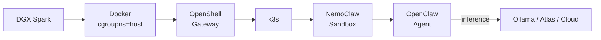

# NemoClaw on DGX Spark

A complete guide to running [NemoClaw](https://github.com/NVIDIA/NemoClaw) — NVIDIA's sandboxed [OpenClaw](https://openclaw.ai) agent framework — on the NVIDIA DGX Spark. Covers cloud inference as a quick start, local inference via Ollama (Nemotron 3 Super 120B), and the Atlas inference engine for maximum performance.

## Table of Contents

- [Overview](#overview)
- [Hardware & Prerequisites](#hardware--prerequisites)
- [Phase 1: Quick Start with NVIDIA Cloud](#phase-1-quick-start-with-nvidia-cloud)
- [Phase 2: Local Inference with Ollama](#phase-2-local-inference-with-ollama)
- [Phase 3: Advanced — Atlas Inference Engine](#phase-3-advanced--atlas-inference-engine)
- [Phase 4: Benchmarks](#phase-4-benchmarks)
- [Troubleshooting](#troubleshooting)
- [References](#references)

## Overview

NemoClaw installs the NVIDIA OpenShell runtime and creates a sandboxed environment where every network request, file access, and inference call is governed by declarative policy. The agent runs inside an isolated container with controlled egress — you approve what it can access.

### Architecture



### Why Nemotron 3 Super 120B?

| Model | Total Params | Active Params | NVFP4 Size | Fits DGX Spark? | Notes |
|-------|-------------|---------------|------------|-----------------|-------|
| Nemotron 3 Nano 30B | 30B | 3.5B (MoE) | ~17 GB | Yes | Fast but less capable |
| **Nemotron 3 Super 120B** | **120B** | **12B (MoE)** | **~67 GB** | **Yes** | **Best balance of speed and quality** |
| Nemotron Ultra 253B | 253B | dense | ~142 GB | No (128GB limit) | Requires 2x DGX Spark |

Nemotron 3 Super 120B is the largest Nemotron model that fits on a single DGX Spark. With only 12B active parameters (MoE), it delivers fast inference while maintaining strong reasoning and tool-calling capabilities.

## Hardware & Prerequisites

### Hardware

| Component | Specification |
|-----------|---------------|
| Device | NVIDIA DGX Spark |
| GPU | NVIDIA GB10 (Blackwell) |
| Memory | 128 GB unified (shared CPU/GPU) |
| CUDA Capability | 12.1 |
| Storage | 3.7 TB NVMe SSD |
| OS | DGX OS (Ubuntu 24.04 based) |
| Architecture | ARM64 (aarch64) |

### Software Requirements

- **Docker** (pre-installed on DGX Spark, v28.x)
- **Node.js 22+** and npm 10+
- **NVIDIA API key** from [build.nvidia.com](https://build.nvidia.com) (for initial cloud setup)
- **NVIDIA OpenShell CLI** (installed automatically by NemoClaw bootstrap, or manually):

```bash
ARCH=$(uname -m)
curl -fsSL "https://github.com/NVIDIA/OpenShell/releases/latest/download/openshell-linux-${ARCH}" \
  -o /usr/local/bin/openshell && chmod +x /usr/local/bin/openshell
```

### DGX Spark Quirks

The DGX Spark has a few platform-specific issues that NemoClaw's `setup-spark` command handles automatically:

| Issue | Cause | Fix |
|-------|-------|-----|
| cgroup v2 kills k3s | Ubuntu 24.04 defaults to cgroup v2, k3s needs v1-style paths | `cgroupns=host` in Docker daemon.json |
| Docker permission denied | User not in docker group | `usermod -aG docker $USER` |
| CoreDNS CrashLoop | DNS resolution fails inside k3s container | `fix-coredns.sh` uses container gateway IP |

### Tested With

| Component | Version |
|-----------|---------|
| DGX OS | Ubuntu 24.04.4 LTS |
| Docker | 29.1.3 |
| Node.js | 22.x (installed by NemoClaw bootstrap) |
| NemoClaw | latest (2026-03-17) |
| Ollama | 0.18.1 |
| Atlas | avarok/atlas-alpha2:latest (v0.1.0) |
| CUDA Driver | 580.126.09 |
| CUDA Version | 13.0 |

## Phase 1: Quick Start with NVIDIA Cloud

Get NemoClaw running in under 5 minutes using NVIDIA's cloud inference. No local model setup needed — just an API key.

### Step 1: Install NemoClaw

```bash
curl -fsSL https://nvidia.com/nemoclaw.sh | bash
```

This installs Node.js (if missing), OpenShell CLI, and NemoClaw.

### Step 2: Fix DGX Spark Compatibility

```bash
sudo nemoclaw setup-spark
```

This configures Docker for cgroup v2 compatibility and adds your user to the docker group. You may need to log out and back in (or run `newgrp docker`) for group changes to take effect.

### Step 3: Onboard with NVIDIA Cloud

```bash
nemoclaw onboard
```

The wizard will prompt you to:
1. Select **NVIDIA Build (build.nvidia.com)** as the inference endpoint
2. Enter your NVIDIA API key
3. Select **Nemotron 3 Super 120B** as the model

### Step 4: Connect to Your Agent

```bash
nemoclaw my-assistant connect
```

### Step 5: Test the Agent

Inside the sandbox, open the interactive TUI:

```bash
sandbox@my-assistant:~$ openclaw tui
```

Send a test message and verify you get a response. Alternatively, test via CLI:

```bash
sandbox@my-assistant:~$ openclaw agent --agent main --local -m "hello" --session-id test
```

You now have a working sandboxed AI agent using NVIDIA cloud inference. Next, we'll move inference to your local GPU.

## Phase 2: Local Inference with Ollama

Move inference from the cloud to your DGX Spark's GPU for privacy, zero cost, and no network dependency.

### Step 1: Install Ollama

```bash
curl -fsSL https://ollama.com/install.sh | sh
```

### Step 2: Pull Nemotron 3 Super 120B

```bash
ollama pull nemotron-3-super:120b
```

This downloads ~87 GB of model weights. The model has 120B total parameters with 12B active (MoE architecture) and supports a 256K context window.

### Step 3: Verify Ollama is Serving

```bash
curl http://localhost:11434/api/tags
```

You should see `nemotron-3-super:120b` in the model list.

### Step 4: Reconfigure NemoClaw for Local Inference

```bash
NEMOCLAW_EXPERIMENTAL=1 nemoclaw onboard \
  --endpoint ollama \
  --model nemotron-3-super:120b
```

> **Note:** Local inference endpoints (Ollama, vLLM) require the `NEMOCLAW_EXPERIMENTAL=1` environment variable. These are functional but marked experimental in the current NemoClaw release.

NemoClaw routes inference through the OpenShell gateway at `http://host.openshell.internal:11434/v1`. The agent inside the sandbox never connects to Ollama directly — all traffic passes through the controlled gateway.

### Step 5: Verify Local Inference

Connect to the sandbox and test:

```bash
nemoclaw my-assistant connect
sandbox@my-assistant:~$ openclaw agent --agent main --local -m "What GPU am I running on?" --session-id test
```

The response should come from your local GPU — you can verify by checking `nvidia-smi` on the host while the agent is responding.

## Phase 3: Advanced — Atlas Inference Engine

[Atlas](https://forums.developer.nvidia.com/t/introducing-the-atlas-inference-server-and-engine/362210) is a pure Rust inference engine with custom SM12.1 kernels. On Qwen3.5-35B-A3B, it achieves **96 tok/s** vs vLLM's ~31 tok/s — a 3x speedup. This section configures NemoClaw to use Atlas for maximum inference performance.

> **Important:** Atlas is AGPL-3.0 licensed, closed source, and in alpha. See [caveats](#atlas-caveats) below.

### Prerequisites

You **must stop Ollama before starting Atlas** — running both simultaneously will OOM the DGX Spark and require a power cycle.

```bash
sudo systemctl stop ollama
```

### Step 1: Pull Atlas Docker Image

```bash
docker pull avarok/atlas-alpha2:latest
```

The image is only ~1.9 GB (vs 20+ GB for vLLM).

### Step 2: Download NVFP4 Model Weights

```bash
python3 -c "from huggingface_hub import snapshot_download; snapshot_download('nvidia/NVIDIA-Nemotron-3-Super-120B-A12B-NVFP4')"
```

If you get permission errors on the HuggingFace cache, fix with:

```bash
docker run --rm -v $HOME/.cache/huggingface:/hf alpine chown -R $(id -u):$(id -g) /hf
```

### Step 3: Launch Atlas

```bash
docker run -d --name atlas \
    --gpus all --ipc=host --network host \
    -v ~/.cache/huggingface:/root/.cache/huggingface \
    avarok/atlas-alpha2:latest serve nvidia/NVIDIA-Nemotron-3-Super-120B-A12B-NVFP4 \
    --port 8001 \
    --kv-cache-dtype nvfp4 \
    --gpu-memory-utilization 0.88 \
    --scheduling-policy slai \
    --max-seq-len 8192 \
    --max-batch-size 16 \
    --tool-call-parser hermes \
    --ssm-cache-slots 8
```

Wait for the server to become ready (~90-120 seconds):

```bash
# Poll until ready
while ! curl -s http://localhost:8001/health > /dev/null 2>&1; do sleep 3; done
echo "Atlas is ready"
curl -s http://localhost:8001/v1/models | python3 -m json.tool
```

### Step 4: Warmup

Atlas requires 8-10 requests to reach full speed (CUDA graph compilation). Send some warmup requests:

```bash
for i in $(seq 1 10); do
    curl -s http://localhost:8001/v1/chat/completions \
        -H "Content-Type: application/json" \
        -d '{"model":"nvidia/NVIDIA-Nemotron-3-Super-120B-A12B-NVFP4","messages":[{"role":"user","content":"Hello"}],"max_tokens":32}' > /dev/null
    echo "warmup $i done"
done
```

### Step 5: Configure NemoClaw to Use Atlas

```bash
NEMOCLAW_EXPERIMENTAL=1 nemoclaw onboard \
  --endpoint vllm \
  --endpoint-url http://host.openshell.internal:8001/v1 \
  --model nvidia/NVIDIA-Nemotron-3-Super-120B-A12B-NVFP4 \
  --api-key dummy
```

### Step 6: Verify

Connect and test as before:

```bash
nemoclaw my-assistant connect
sandbox@my-assistant:~$ openclaw agent --agent main --local -m "hello" --session-id test
```

### Critical: Set reasoning=false for Atlas

When using Atlas with OpenClaw, you **must** set `reasoning: false` in both config files inside the sandbox. Otherwise OpenClaw instructs the model to think step-by-step, but Atlas's API doesn't return a separate `thinking` field — the model's reasoning leaks into the visible response and the actual answer is lost.

Fix both files inside the sandbox:

```bash
# Connect to sandbox
nemoclaw <name> connect

# Fix openclaw.json — set reasoning to false for the model
python3 -c "
import json
for path in [
    '/sandbox/.openclaw/openclaw.json',
    '/sandbox/.openclaw/agents/main/agent/models.json'
]:
    try:
        with open(path) as f:
            d = json.load(f)
        providers = d.get('models', d).get('providers', d.get('providers', {}))
        for prov in providers.values():
            for m in prov.get('models', []):
                m['reasoning'] = False
        with open(path, 'w') as f:
            json.dump(d, f, indent=2)
        print(f'Fixed {path}')
    except Exception as e:
        print(f'Skip {path}: {e}')
"
```

### Atlas Caveats

| Concern | Detail |
|---------|--------|
| License | AGPL-3.0 (may affect commercial use) |
| Source | Closed source — no ability to audit or debug |
| Maturity | Alpha 2 — expect breaking changes |
| Image tag | `avarok/atlas-alpha2:latest` may change — check [Atlas Discord](https://forums.developer.nvidia.com/t/introducing-the-atlas-inference-server-and-engine/362210) for current tags |
| Context length | Tested with `--max-seq-len 8192` — higher values may impact memory |

### Switching Back to Ollama

```bash
docker stop atlas
sudo systemctl start ollama
NEMOCLAW_EXPERIMENTAL=1 nemoclaw onboard --endpoint ollama --model nemotron-3-super:120b
```

## Phase 4: Benchmarks

Benchmark results for Nemotron 3 Super 120B on DGX Spark comparing Ollama and Atlas inference engines.

> Benchmarks are run using `benchmarks/benchmark-nemotron.py`. Results will be populated after on-device testing.

### Running the Benchmarks

```bash
# Ollama benchmarks
python3 benchmarks/benchmark-nemotron.py --engine ollama --test all

# Atlas benchmarks (stop Ollama first)
sudo systemctl stop ollama
python3 benchmarks/benchmark-nemotron.py --engine atlas --test all
```

### Single Request Speed (Ollama, Nemotron 3 Super 120B)

| Test | Time | Est. tok/s | TTFT |
|------|------|-----------|------|
| Short response (128 tokens) | 6.7s | ~10 | 321ms |
| Medium response (1024 tokens) | 51.6s | ~8.3 | 392ms |
| Long response (4096 tokens) | 206.2s | ~8.3 | 400ms |
| Code generation (2048 tokens) | 103.2s | ~10.3 | 458ms |
| Reasoning (256 tokens) | 8.4s | ~8.3 | 403ms |

### Speed Validation (10 iterations, 1024 max tokens)

| Metric | Ollama |
|--------|--------|
| Mean | 5.8 tok/s |
| Median | 5.6 tok/s |
| Stddev | 1.6 tok/s |
| Min | 2.9 tok/s |
| Max | 8.3 tok/s |

> Note: Token counts are estimated (word-based). The variance is due to the model's thinking/reasoning mode consuming tokens internally. Actual decode speed is consistent (~51.5s per 1024-token request).

### Concurrency (RAG-style prompts)

| Concurrent Users | Per-User tok/s | Aggregate tok/s | Avg Latency |
|:---:|---:|---:|---:|
| 1 | 2.1 | 2.1 | 6.7s |
| 5 | 1.2 | 1.9 | 18.9s |
| 10 | 0.4 | 2.2 | 39.3s |
| 20 | 0.5 | 1.8 | 66.9s |

### GPU Memory Usage

| Engine | Model Memory | Notes |
|--------|-------------|-------|
| Ollama (Nemotron 3 Super 120B) | 89.7 GB | 70% of 128GB unified memory |
| Atlas (Qwen3.5-35B-A3B NVFP4) | 10.3 GB | See [sibling repo](https://github.com/adadrag/qwen3.5-dgx-spark) |

### Cross-Model Comparison (DGX Spark)

| Model | Engine | Median tok/s | TTFT | Memory |
|-------|--------|-------------|------|--------|
| Qwen3.5-35B-A3B (3B active) | Atlas | **95.9** | 40ms | 10.3 GB |
| Qwen3.5-35B-A3B (3B active) | vLLM | ~31 | varies | ~18 GB |
| Nemotron 3 Super 120B (12B active) | Ollama | ~5.8 | 400ms | 89.7 GB |

The 120B model is 4x the active parameters of the 35B model and uses 9x more memory, resulting in significantly slower inference. For latency-sensitive applications, the 35B MoE models on Atlas offer the best performance on DGX Spark.

> See `benchmarks/results/` for raw JSON data.

## Troubleshooting

### OOM when running multiple inference engines

Running Ollama and Atlas simultaneously will exhaust the 128GB unified memory and freeze the system, requiring a power cycle.

**Fix:** Always stop one engine before starting another:

```bash
# Before starting Atlas
sudo systemctl stop ollama

# Before starting Ollama
docker stop atlas
```

### cgroup v2 / k3s fails to start

```
openat2 /sys/fs/cgroup/kubepods/pids.max: no
Failed to start ContainerManager
```

**Fix:** Run `sudo nemoclaw setup-spark` or manually:

```bash
sudo python3 -c "
import json, os
path = '/etc/docker/daemon.json'
d = json.load(open(path)) if os.path.exists(path) else {}
d['default-cgroupns-mode'] = 'host'
json.dump(d, open(path, 'w'), indent=2)
"
sudo systemctl restart docker
```

### HuggingFace cache permission denied

```
PermissionError: [Errno 13] Permission denied: '/home/user/.cache/huggingface/hub/models--...'
```

**Fix:** The cache directory was created by a root Docker process:

```bash
docker run --rm -v $HOME/.cache/huggingface:/hf alpine chown -R $(id -u):$(id -g) /hf
```

### CoreDNS CrashLoop

The embedded k3s DNS fails because it uses the Docker bridge DNS (127.0.0.11) instead of the container gateway.

**Fix:** NemoClaw includes `fix-coredns.sh` — run it after setup, or destroy and recreate the gateway:

```bash
openshell gateway destroy && openshell gateway start
```

### Docker permission denied

```
Permission denied (os error 13)
```

**Fix:**

```bash
sudo usermod -aG docker $USER
newgrp docker  # or log out and back in
```

### OpenShell gateway can't reach Ollama

```
failed to connect to http://host.openshell.internal:11434/v1
```

**Cause:** Ollama defaults to listening on `127.0.0.1` only. The k3s pod inside OpenShell can't reach localhost.

**Fix:** Make Ollama listen on all interfaces:

```bash
sudo bash -c 'mkdir -p /etc/systemd/system/ollama.service.d && \
echo -e "[Service]\nEnvironment=\"OLLAMA_HOST=0.0.0.0\"" > /etc/systemd/system/ollama.service.d/override.conf && \
systemctl daemon-reload && systemctl restart ollama'
```

Then update the provider to use the host's actual IP:

```bash
HOST_IP=$(hostname -I | awk '{print $1}')
openshell provider update ollama-local --config "OPENAI_BASE_URL=http://${HOST_IP}:11434/v1"
openshell inference set --provider ollama-local --model nemotron-3-super:120b
```

### OpenClaw memory lost when sandbox is recreated

OpenClaw stores conversation history, personality (`soul.md`), and memory (`memory.md`) inside the sandbox at `/sandbox/.openclaw/`. These files are **ephemeral** — they are lost when the sandbox is destroyed and recreated (e.g., during re-onboarding or upgrades).

**Workaround:** Back up before destroying a sandbox:

```bash
# Connect to sandbox
nemoclaw <name> connect

# Inside sandbox — create backup
tar czf /tmp/openclaw-backup.tar.gz ~/.openclaw/
exit

# From host — pull the backup out
openshell sandbox exec <name> -- cat /tmp/openclaw-backup.tar.gz > ~/openclaw-backup.tar.gz
```

To restore after creating a new sandbox:

```bash
# Copy backup into new sandbox
openshell sandbox exec <name> -- bash -c 'cat > /tmp/openclaw-backup.tar.gz' < ~/openclaw-backup.tar.gz

# Connect and restore
nemoclaw <name> connect
cd ~ && tar xzf /tmp/openclaw-backup.tar.gz
```

### OpenClaw version pinned inside NemoClaw

NemoClaw pins OpenClaw to a specific version in its Dockerfile (e.g., `openclaw@2026.3.11`). It does not auto-update. You cannot update it inside the sandbox due to network policy restrictions. To get a newer OpenClaw version, wait for an updated NemoClaw release.

### NemoClaw experimental endpoints not showing

If the onboard wizard only shows "NVIDIA Build" and "NCP" options, local inference endpoints are hidden.

**Fix:** Set the experimental flag:

```bash
NEMOCLAW_EXPERIMENTAL=1 nemoclaw onboard
```

## References

- [NemoClaw Documentation](https://docs.nvidia.com/nemoclaw/latest/)
- [NemoClaw GitHub](https://github.com/NVIDIA/NemoClaw)
- [NemoClaw DGX Spark Guide](https://github.com/NVIDIA/NemoClaw/blob/main/spark-install.md)
- [Atlas Inference Engine (NVIDIA Forums)](https://forums.developer.nvidia.com/t/introducing-the-atlas-inference-server-and-engine/362210)
- [Nemotron 3 Super 120B on Ollama](https://ollama.com/library/nemotron-3-super)
- [Nemotron 3 Super 120B NVFP4 on HuggingFace](https://huggingface.co/nvidia/NVIDIA-Nemotron-3-Super-120B-A12B-NVFP4)
- [Qwen3.5-35B-A3B DGX Spark Benchmarks](https://github.com/adadrag/qwen3.5-dgx-spark) (sibling repo with Atlas benchmarks)
- [OpenClaw](https://openclaw.ai)
- [NVIDIA OpenShell](https://github.com/NVIDIA/OpenShell)

## License

This project is licensed under the [Apache License 2.0](LICENSE).
