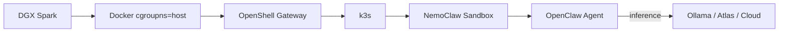

# NemoClaw on DGX Spark — Implementation Plan

> **For agentic workers:** REQUIRED: Use superpowers:subagent-driven-development (if subagents available) or superpowers:executing-plans to implement this plan. Steps use checkbox (`- [ ]`) syntax for tracking.

**Goal:** Create a public GitHub repository with a comprehensive guide for installing NemoClaw on DGX Spark with local inference (Ollama + Atlas) and benchmarks for Nemotron 3 Super 120B.

**Architecture:** A documentation-first repo with a linear README walkthrough (cloud quick-start, Ollama local, Atlas advanced), automation scripts, and a benchmark suite. Follows the same pattern as the sibling `qwen3.5-dgx-spark` repo.

**Tech Stack:** Bash scripts, Python 3 (benchmarks), Mermaid (diagrams), GitHub CLI

**Spec:** `docs/superpowers/specs/2026-03-17-nemoclaw-dgx-spark-design.md`

---

## Chunk 1: Repository Scaffolding

### Task 1: Initialize Git repository and create project files

**Files:**
- Create: `/mnt/c/Users/tati/Documents/GitHub/nemoclaw-dgx-spark/.gitignore`
- Create: `/mnt/c/Users/tati/Documents/GitHub/nemoclaw-dgx-spark/LICENSE`
- Create: `/mnt/c/Users/tati/Documents/GitHub/nemoclaw-dgx-spark/CLAUDE.md`

- [ ] **Step 1: Initialize git repo**

```bash
cd /mnt/c/Users/tati/Documents/GitHub/nemoclaw-dgx-spark
git init
```

- [ ] **Step 2: Create .gitignore**

```gitignore
# Python
__pycache__/
*.py[cod]
*.egg-info/
venv/
.env

# Node
node_modules/

# OS
.DS_Store
Thumbs.db

# IDE
.vscode/
.idea/

# Benchmark artifacts
benchmarks/results/*.json
*.tmp
```

- [ ] **Step 3: Create Apache 2.0 LICENSE**

Use the standard Apache 2.0 license text with `Copyright 2026 adadrag`.

- [ ] **Step 4: Create CLAUDE.md**

WAT framework adapted for this project:
- Layer 1 (Workflows): README phases are the SOPs
- Layer 2 (Agents): Claude Code orchestrates
- Layer 3 (Tools): `scripts/` and `benchmarks/`
- Reference DGX Spark at 192.168.42.2, SSH alias `dgx-spark`
- Note: never run multiple inference engines simultaneously

- [ ] **Step 5: Create directory structure**

```bash
mkdir -p benchmarks/results scripts
```

- [ ] **Step 6: Commit scaffolding**

```bash
git add .gitignore LICENSE CLAUDE.md
git commit -m "Initial commit: repository scaffolding with Apache 2.0 license"
```

---

### Task 2: Verify Nemotron 3 Super 120B availability

This is a research task that determines the Atlas section's scope. Must be completed before writing README Phase 3 and the benchmark script.

**Files:** None (research only)

- [ ] **Step 1: Check Ollama model tag**

```bash
# On DGX Spark
ssh dgx-spark "curl -s https://ollama.com/library/nemotron-3-super 2>&1 | head -20"
# Or search Ollama library
ssh dgx-spark "ollama list 2>/dev/null; ollama search nemotron 2>/dev/null"
```

Record the exact model tag. If not found, check `nemotron3-super`, `nvidia/nemotron-3-super`.

- [ ] **Step 2: Check NVFP4 weights on HuggingFace for Atlas**

```bash
# Check if the NVFP4 model exists
curl -s "https://huggingface.co/api/models/nvidia/NVIDIA-Nemotron-3-Super-120B-A12B-NVFP4" | python3 -c "import sys,json; d=json.load(sys.stdin); print(d.get('id','NOT FOUND'))"
```

- [ ] **Step 3: Document findings**

Record in a temp file which path to take:
- Path A: Both Ollama and Atlas benchmarks for Nemotron 3 Super (head-to-head)
- Path B: Ollama-only benchmarks, Atlas section references sibling repo

---

## Chunk 2: README — Overview, Prerequisites, Phase 1

### Task 3: Write README overview and prerequisites sections

**Files:**
- Create: `/mnt/c/Users/tati/Documents/GitHub/nemoclaw-dgx-spark/README.md`

- [ ] **Step 1: Write header and overview**

Include:
- Title: `# NemoClaw on DGX Spark`
- One-paragraph description of what NemoClaw is and what this guide covers
- Table of contents linking to all phases
- Mermaid architecture diagram:



- Model selection rationale table (Nano 30B vs Super 120B vs Ultra 253B)

- [ ] **Step 2: Write Hardware & Prerequisites section**

Include:
- Hardware specs table (GB10, 128GB unified, CC 12.1, ARM64, 3.7TB NVMe)
- Software requirements list (Docker 28.x, Node.js 22+, OpenShell CLI, NVIDIA API key)
- OpenShell manual install command as fallback
- Known DGX Spark quirks list (cgroup v2, Docker perms, CoreDNS)
- "Tested With" table (versions to be filled during on-device testing)

- [ ] **Step 3: Write Phase 1 — Quick Start with NVIDIA Cloud**

Steps:
1. Install NemoClaw: `curl -fsSL https://nvidia.com/nemoclaw.sh | bash`
2. DGX Spark fix: `sudo nemoclaw setup-spark`
3. Onboard: `nemoclaw onboard` (select NVIDIA Build, enter API key, select Nemotron 3 Super 120B)
4. Connect: `nemoclaw my-assistant connect`
5. Test: `openclaw tui` — send a message, verify response
6. Alternative CLI test: `openclaw agent --agent main --local -m "hello" --session-id test`

- [ ] **Step 4: Commit**

```bash
git add README.md
git commit -m "Add README with overview, prerequisites, and Phase 1 cloud quick-start"
```

---

## Chunk 3: README — Phase 2 (Ollama) and Phase 3 (Atlas)

### Task 4: Write Phase 2 — Local Inference with Ollama

**Files:**
- Modify: `/mnt/c/Users/tati/Documents/GitHub/nemoclaw-dgx-spark/README.md`

- [ ] **Step 1: Write Phase 2 section**

Steps:
1. Install Ollama: `curl -fsSL https://ollama.com/install.sh | sh`
2. Pull model: `ollama pull nemotron-3-super:120b` (use verified tag from Task 2)
3. Verify serving: `curl http://localhost:11434/api/tags`
4. Reconfigure NemoClaw:
   ```bash
   NEMOCLAW_EXPERIMENTAL=1 nemoclaw onboard \
     --endpoint ollama \
     --model nemotron-3-super:120b
   ```
5. Verify: connect to sandbox, send message, confirm local inference
6. Note about `host.openshell.internal:11434/v1` routing

If Ollama tag not found in Task 2, document GGUF import fallback path.

- [ ] **Step 2: Commit**

```bash
git add README.md
git commit -m "Add Phase 2: local inference with Ollama"
```

---

### Task 5: Write Phase 3 — Atlas Inference Engine

**Files:**
- Modify: `/mnt/c/Users/tati/Documents/GitHub/nemoclaw-dgx-spark/README.md`

- [ ] **Step 1: Write Phase 3 section**

Content depends on Task 2 findings:

**Path A (NVFP4 available):**
1. Stop Ollama: `systemctl stop ollama`
2. Pull Atlas: `docker pull avarok/atlas-alpha2:latest`
3. Download NVFP4 weights: `python3 -c "from huggingface_hub import snapshot_download; snapshot_download('nvidia/NVIDIA-Nemotron-3-Super-120B-A12B-NVFP4')"`
4. Fix HF cache permissions if needed
5. Launch Atlas with `spark serve` command and appropriate flags
6. Configure NemoClaw: `NEMOCLAW_EXPERIMENTAL=1 nemoclaw onboard --endpoint vllm --endpoint-url http://host.openshell.internal:8001/v1 --model nemotron-3-super`
7. Warmup notes (8-10 requests)
8. AGPL-3.0 / closed source caveats

**Path B (NVFP4 not available):**
- Brief Atlas overview with link to `qwen3.5-dgx-spark` repo benchmarks
- Note that Nemotron 3 Super support is pending
- Instructions for using Atlas with Qwen3.5-35B-A3B as alternative

- [ ] **Step 2: Commit**

```bash
git add README.md
git commit -m "Add Phase 3: Atlas inference engine (advanced)"
```

---

## Chunk 4: Benchmark Script and Results

### Task 6: Create benchmark script

**Files:**
- Create: `/mnt/c/Users/tati/Documents/GitHub/nemoclaw-dgx-spark/benchmarks/benchmark-nemotron.py`

- [ ] **Step 1: Write the benchmark script**

Adapt from `/mnt/c/Users/tati/Documents/GitHub/qwen3.5-dgx-spark/atlas-benchmark/benchmark.py` with these changes:
- Default model: Nemotron 3 Super 120B (use model name from Task 2)
- Support both Ollama (port 11434) and Atlas/vLLM (port 8001) endpoints
- 5 warmup requests discarded before measurement
- Use API-reported `response_token/s` when available (Atlas), fall back to client-side estimation (Ollama)
- Test suites: single, concurrency, claims
- `--engine` flag to select ollama or atlas
- Output to `benchmarks/results/`

Key functions:
- `chat_completion()` — handles both OpenAI-compatible and Ollama endpoints
- `run_single_benchmarks()` — short/medium/long/code/reasoning prompts
- `run_concurrency_benchmark()` — RAG-style prompts at 1/5/10/20 users
- `run_warmup()` — 5 discarded requests
- `main()` — argparse with `--engine`, `--url`, `--model`, `--test`, `--output`

- [ ] **Step 2: Commit**

```bash
git add benchmarks/benchmark-nemotron.py
git commit -m "Add Nemotron 3 Super 120B benchmark script"
```

---

### Task 7: Run benchmarks on DGX Spark and record results

**Files:**
- Create: `/mnt/c/Users/tati/Documents/GitHub/nemoclaw-dgx-spark/benchmarks/results/.gitkeep`

This is an on-device task requiring SSH to the DGX Spark.

- [ ] **Step 1: Copy benchmark script to DGX Spark**

```bash
scp benchmarks/benchmark-nemotron.py dgx-spark:~/nemoclaw-benchmark/
```

- [ ] **Step 2: Run Ollama benchmarks**

```bash
ssh dgx-spark "cd ~/nemoclaw-benchmark && python3 benchmark-nemotron.py --engine ollama --test all --output ollama-results.json"
```

- [ ] **Step 3: Run Atlas benchmarks (if Path A from Task 2)**

```bash
ssh dgx-spark "cd ~/nemoclaw-benchmark && python3 benchmark-nemotron.py --engine atlas --test all --output atlas-results.json"
```

- [ ] **Step 4: Copy results back**

```bash
scp dgx-spark:~/nemoclaw-benchmark/*-results.json benchmarks/results/
```

- [ ] **Step 5: Commit results placeholder**

```bash
git add benchmarks/results/.gitkeep
git commit -m "Add benchmark results directory"
```

---

## Chunk 5: README — Benchmarks, Troubleshooting, Scripts

### Task 8: Write Phase 4 — Benchmarks section in README

**Files:**
- Modify: `/mnt/c/Users/tati/Documents/GitHub/nemoclaw-dgx-spark/README.md`

- [ ] **Step 1: Write benchmarks section**

Include:
- How to run the benchmark script
- Results table: single request speed (tok/s, TTFT) for each engine
- Concurrency table: 1/5/10/20 users aggregate tok/s
- GPU memory usage comparison
- If Path A: Ollama vs Atlas side-by-side comparison table
- If Path B: Ollama results only, link to Atlas benchmarks in sibling repo

- [ ] **Step 2: Write Troubleshooting section**

Cover all items from spec section 4.7:
- OOM with multiple engines
- cgroup v2 / k3s fix
- HF cache permissions
- CoreDNS CrashLoop
- Docker permission denied
- NEMOCLAW_EXPERIMENTAL not showing options

- [ ] **Step 3: Write References section**

Links to NemoClaw docs, GitHub, Atlas Discord, NVIDIA forums, sibling repo.

- [ ] **Step 4: Commit**

```bash
git add README.md
git commit -m "Add benchmarks, troubleshooting, and references sections"
```

---

### Task 9: Create automation scripts

**Files:**
- Create: `/mnt/c/Users/tati/Documents/GitHub/nemoclaw-dgx-spark/scripts/setup-nemoclaw.sh`
- Create: `/mnt/c/Users/tati/Documents/GitHub/nemoclaw-dgx-spark/scripts/setup-atlas.sh`

- [ ] **Step 1: Write setup-nemoclaw.sh**

Automates Phase 1 + Phase 2:
1. Check prerequisites (Docker, GPU)
2. Install Node.js 22 if missing
3. Install NemoClaw: `curl -fsSL https://nvidia.com/nemoclaw.sh | bash`
4. Run `sudo nemoclaw setup-spark`
5. Install Ollama
6. Pull Nemotron 3 Super model
7. Run `NEMOCLAW_EXPERIMENTAL=1 nemoclaw onboard --endpoint ollama --model <tag>`
8. Verify with a test inference call

- [ ] **Step 2: Write setup-atlas.sh**

Automates Phase 3:
1. `ATLAS_IMAGE` variable at top for easy tag updates
2. Stop Ollama
3. Pull Atlas image
4. Download NVFP4 model weights (or skip with note if unavailable)
5. Launch Atlas container
6. Wait for health check
7. Reconfigure NemoClaw endpoint
8. Run warmup requests

- [ ] **Step 3: Make scripts executable and commit**

```bash
chmod +x scripts/*.sh
git add scripts/
git commit -m "Add setup automation scripts for NemoClaw and Atlas"
```

---

## Chunk 6: GitHub Repository and Final Polish

### Task 10: Create GitHub repository and push

**Files:** None (git operations only)

- [ ] **Step 1: Create public GitHub repo**

```bash
cd /mnt/c/Users/tati/Documents/GitHub/nemoclaw-dgx-spark
gh repo create nemoclaw-dgx-spark --public --description "NemoClaw on DGX Spark: setup guide with local inference (Ollama + Atlas) and Nemotron 3 Super 120B benchmarks" --source . --push
```

- [ ] **Step 2: Verify repo is live**

```bash
gh repo view nemoclaw-dgx-spark --web
```

- [ ] **Step 3: Add repository topics**

```bash
gh repo edit --add-topic nvidia,dgx-spark,nemoclaw,openclaw,ollama,nemotron,inference,benchmark
```

---

### Task 11: Final review and cleanup

**Files:**
- Modify: `/mnt/c/Users/tati/Documents/GitHub/nemoclaw-dgx-spark/README.md` (fill in version table)

- [ ] **Step 1: Fill in "Tested With" version table**

SSH to DGX Spark and capture actual versions:
```bash
ssh dgx-spark "docker --version; node --version; ollama --version; cat /etc/os-release | grep VERSION"
```

- [ ] **Step 2: Review README end-to-end**

Read through the full README and verify:
- All commands are correct
- No placeholder text remains
- Links work
- Tables render properly

- [ ] **Step 3: Final commit and push**

```bash
git add -A
git commit -m "Fill in tested versions and final polish"
git push
```
